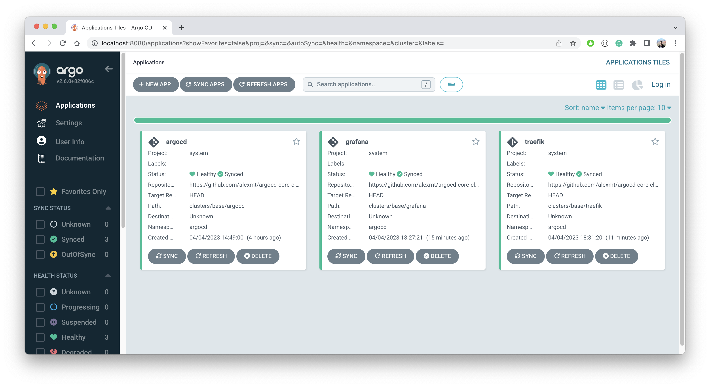

# Argo CD Core - A Pure GitOps Agent for Kubernetes

The repository contains an opinionated directory structure that enables Kubernetes administrators to efficiently use of Argo CD to bootstrap
and manage fleet of Kubernetes clusters.

The repository is used to power demo presented at Kubecon EU 2023. See https://sched.co/1HySi for more information.


## Overview

Argo CD is used by both application developers and cluster administrators. The latter use cases are slightly different from the former.
The main difference is that cluster administrators typically manage way more applications in multiple clusters and have to leverage more advanced techniques.
We've identified the following main use cases for cluster administrators:

* **Cluster Addons** - set of applications that have to be installed on every cluster.
* **Cluster Groups** - ability to split the clusters fleet into multiple groups and customize each group independently.
* **Snowflake Clusters** - ability to customize the applications configuration on a per-cluster basis.

## Prerequisites

You will need to install the following tools to use the repository:

* [git](https://git-scm.com/)
* [kubectl](https://kubernetes.io/docs/tasks/tools/install-kubectl/)
* [kustomize](https://kubernetes-sigs.github.io/kustomize/installation/)
* [argocd cli](https://argo-cd.readthedocs.io/en/stable/getting_started/#2-download-argo-cd-cli)
* [k3d](https://k3d.io/) - or access to an empty Kubernetes cluster

## Let's Get Started

Assuming all the prerequisites are installed and you have access to 3 empty Kubernetes clusters, we can jump right into the demo.

### Cluster Addons

Installing a homogeneous set of applications into multiple Kubernetes clusters is the most common task cluster administrators need to solve. These applications are sometimes
referred to as "cluster addons" and might include things like ingress controllers, monitoring, logging, service meshes, etc. The implicit requirement is that each and every
application setting should be configured in Git - no manual configurations.

Time to check our deployment repository. As you can expect it contains deployment manifests of cluster addons. The manifests are located in `clusters/base` directory:

```
clusters/base
├── argocd
├── grafana
└── traefik
```

Each directory represents a single application. The typical recommendation to application developers is to leverage Argo CD and manually create Argo CD Application CR per directory.
This is perfectly fine if you need to manage a few applications but cluster administrators have to take care of dozens if not hundreds! Creating Argo CD applications manually is not an option.
Instead, we can GitOps Argo CD configuration and let it manage itself. As you could've noticed, one of the directories is called `argocd`. This directory contains Argo CD installation manifests
as well as ApplicationSet definition that automates application creation.

Let's go ahead apply the Argo CD manifests to the cluster:

```bash
$ kustomize build https://github.com/alexmt/argocd-core-cluster-management//clusters/base/argocd | kubectl apply -f -
```

The running a command above, you should see the following applications in Argo CD namespace:

```bash
$ kubectl get applications -n argocd
NAME      SYNC STATUS   HEALTH STATUS
traefik   Synced        Healthy
argocd    Synced        Healthy
grafana   Synced        Healthy
```

There is a better way to see what is happening in the cluster. Run the following command to open Argo CD UI:

```bash 
$ argocd admin dashboard -n argocd
Argo CD UI is available at http://localhost:8080
```

Open the URL in your browser, and you should see the following screen:



So how exactly Argo CD applications get created? This logic is declaratively defined in the ApplicationSet resource located in
[applications.yaml](https://github.com/alexmt/argocd-core-cluster-management/blob/master/clusters/base/argocd/applications.yaml) file. The application set
is taking care of all three use cases we identified earlier, so let's explore it step by step staring from the most basic use case:


```yaml
- git:
    repoURL: https://github.com/alexmt/argocd-core-cluster-management.git
    directories:
    - path: clusters/base/*
```

The YAML snippet above is a Git application set generator. It tells Argo CD to look at the specified repository and create an Argo CD
application for each directory that matches a specific path. So in order to add a new application to all clusters we just need to add a new directory
under `clusters/base` and push changes to Git.


The first use case is solved. No need to touch Argo CD configuration again, the process is scalable and fully automated.:

* ApplicationSet will detect a new directory and create a new Argo CD application.
* Argo CD will detect a new application and sync it to the cluster.
* New changes in the Git directory will be automatically synced to the cluster.

### Cluster Groups

In real life, changes are rarely made to all clusters at the same time. Instead, clusters are grouped logically and changes are "promoted" from group to group. In the same way, we use directory structure conversion in the Git repository to represent individual applications, we can use the directory structure to represent cluster groups.

Let's take a look at the directory structure:

```
clusters/groups
├── prod
│   └── <app-name>
├── stage
│   └── <app-name>
└── test
    └── <app-name>
```

Each directory represents a cluster group. By default, group inherits all applications from the `clusters/base` directory. In order to
customize the application for a specific group, we can add a directory with the same name under the group directory. For example, if we want to customize the `traefik` application for the `prod` group, we can add a directory called `traefik` under `clusters/groups/prod` directory. Each cluster is assigned to
a group using a label on Argo CD secret the represents the cluster.

Finally the convention is defined in the ApplicationSet resource and implemented using `merge` and `matrix` generators:

```yaml
- matrix:
    generators:
    # enriches applications per directory in clusters/base with cluster labels
    - clusters: {}
    # produces argocd app per directory in clusters/base
    - git:
        repoURL: &repo https://github.com/alexmt/argocd-core-cluster-management.git
        directories:
        - path: clusters/base/*
- merge:
    mergeKeys:
    - path
    generators:
    # adds env metadata from .env.yaml to each application
    # workaround for https://github.com/argoproj/argo-cd/issues/13118 - should use env directory name instead
    - git:
        repoURL: *repo
        revision: HEAD
        files:
        - path: clusters/groups/*/.env.yaml
    # discovers environment specific applications overrides
    - git:
        repoURL: *repo
        revision: HEAD
        directories:
        - path: clusters/groups/*/*
```

Run the following command to assign our cluster to the `test` group:


```bash
$ kustomize build https://github.com/alexmt/argocd-core-cluster-management//clusters/groups/test/argocd | kubectl apply -f -
```

After applying the manifests you should see that the `grafana` application now uses manifests from `clusters/groups/test/grafana` directory:

```bash
$ kubectl get apps grafana -o=custom-columns=path:.spec.source.path
path
clusters/groups/test/grafana
```